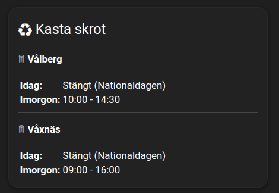

# Home Assistant Integration: Karlstad Återvinningscentraler

This custom integration creates one sensor per recycling center (återvinningscentral) in Karlstad, fetching today's and tomorrow's opening hours from [Karlstads Energi](https://karlstadsenergi.se/atervinning/atervinningscentraler).

## Features
- One sensor per center (e.g., `sensor.karlstad_avc_heden`)
- Updates daily
- Shows today's and tomorrow's opening hours

## Installation
1. Copy the `custom_components/karlstad_avc/` directory into your Home Assistant `custom_components` folder.
2. Restart Home Assistant.
3. Add the integration via YAML or the UI (if supported).

## Configuration
No configuration needed for basic usage. Sensors will be created automatically for each center.

## Example Dashboard Card
Below is an example of a Home Assistant Markdown card that displays today and tomorrow's opening hours for Vålberg and Våxnäs, using tables for alignment and a horizontal rule for separation:

```markdown
🗑️ **Vålberg**
|        |                |
|--------|----------------|
| **Idag:**    | {{ states('sensor.karlstad_avc_valberg') }} |
| **Imorgon:** | {{ state_attr('sensor.karlstad_avc_valberg', 'tomorrow') }} |
<hr>

🗑️ **Våxnäs**
|        |                |
|--------|----------------|
| **Idag:**    | {{ states('sensor.karlstad_avc_vaxnas') }} |
| **Imorgon:** | {{ state_attr('sensor.karlstad_avc_vaxnas', 'tomorrow') }} |
```

## Example Screenshot



## Attribution
Data fetched from [Karlstads Energi](https://karlstadsenergi.se/atervinning/atervinningscentraler). 